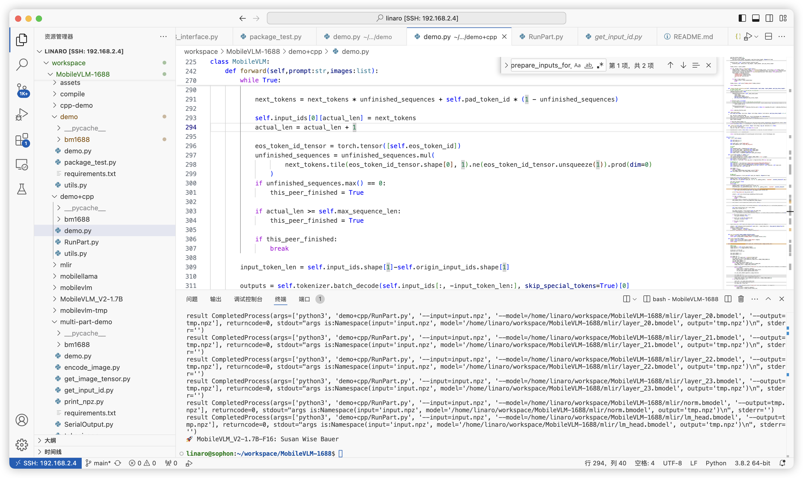

# 项目说明
本项目，将MobileVLM转换成能在bm1688上面能够运行的模型。

## 主要步骤：
0. [环境准备](#environment)
1. [模型转换](#transform)
2. [模型部署](#deploy)

<a id="environment"></a>

# 环境准备
本项目通过使用算丰提供的标准SDK环境，进行开发。

0. 准备一个工作目录
```shell
mkdir ~/worksapce
```

1. 下载算丰bm1688相关的sdk。[算丰](https://developer.sophgo.com/site/index/material/89/all.html)

也可以使用下面的命令进行下载。
```shell
wget https://sophon-file.sophon.cn/sophon-prod-s3/drive/24/07/26/14/sophonsdk_edge_v1.7_official_release.zip
```

2. 搭建docker环境

不管是模型的转换，还是模型的部署编译，都需要在一个相对稳定的环境中进行。算丰官网提供了稳定的docker镜像。

- 保证gnome-terminal
```
sudo apt install gnome-terminal
```
- 安装Docker的其他依赖库,注意下面的安装可能会有网络问题，如果出现网络问题，可以给apt增加一个代理。如：
```
sudo apt -o Acquire::http::proxy="http://127.0.0.1:12333" update
```

```
sudo apt-get update
sudo apt-get install ca-certificates curl
sudo install -m 0755 -d /etc/apt/keyrings
sudo curl -fsSL https://download.docker.com/linux/ubuntu/gpg -o /etc/apt/keyrings/docker.asc
sudo chmod a+r /etc/apt/keyrings/docker.asc

# Add the repository to Apt sources:
echo \
  "deb [arch=$(dpkg --print-architecture) signed-by=/etc/apt/keyrings/docker.asc] https://download.docker.com/linux/ubuntu \
  $(. /etc/os-release && echo "$VERSION_CODENAME") stable" | \
  sudo tee /etc/apt/sources.list.d/docker.list > /dev/null
sudo apt-get update
```

- 下载安装包
```
wget https://desktop.docker.com/linux/main/amd64/149282/docker-desktop-4.30.0-amd64.deb?utm_source=docker&utm_medium=webreferral&utm_campaign=docs-driven-download-linux-amd64&_gl=1*1s8tvji*_ga*ODMxMjAyNS4xNzE3ODU3MTgw*_ga_XJWPQMJYHQ*MTcxODExNjQxOC42LjEuMTcxODExNjUyMi42MC4wLjA.
```

- 安装
```
sudo apt-get install ./docker-desktop-<version>-<arch>.deb
```

- 打开
```
systemctl --user start docker-desktop
```

3. 使用docker和sdk搭建模型转换环境

- 进入sdk/docker,使用其提供的ubuntu_bm1688.tar加载镜像
```shell
cat ubuntu_bm1688.tar | docker import - ubuntu-bm1688
cd ~/workspace
docker run --name ubuntu_bm1688_sdk -v $PWD:/workspace -it ubuntu-bm1688:latest  /bin/bash
## 下次启动可直接运行下面的命令
docker start -i ubuntu_bm1688_sdk
```
- 保证环境OK
```shell
pip install ${sophone_edge_sdk}/tpu-mlir/tpu_mlir-1.8.1-py3-none-any.whl
```

<a id="transform"></a>

# 模型转换

1. 准备待转换的模型
```shell
pip install -U "huggingface_hub[cli]"
huggingface-cli download mtgv/MobileVLM_V2-1.7B --local-dir MobileVLM_V2-1.7B
```
2. 因为MobileVLM的上下文特别长，为了适配bm1688，将其上下文改成512个token
```
将config.json中的max_sequence_length改为512，以满足内存需求
```
3. 将模型导出为ONNX (注意:可以放在一个更快的主机中运行)
```shell
#模型转换前，设置python的查找路径
export PYTHONPATH=$PYTHON:$(pwd)/MobileVLM-1688
python compile/export_mobilevlm_onnx.py
```
生成的onnx模型，将会保存在mobilevlm-tmp文件夹下

4. 将ONNX模型，转成bmodel模型
```shell
## 进入docker环境
./compile/compile.sh
```
生成的最终bmodel，将会保存在mlir文件夹下

<a id="transform"></a>

# 模型部署

1. 准备bm1688-soc环境。

本项目，使用了firefly的[EC-A1688JD4](https://www.t-firefly.com/product/embed/eca1688jd4)

2. 将算丰SDK中的sophon-img目录下的sdcard.tgz烧录进板子
- 将SDcard格式化为MBR分区，FAT32格式，如果有多个分区，应该放在第一个主分区中。
- 连接串口，波特率为115200

3. 准备交叉编译环境

- 因为soc中的环境为ubuntu20.04. 所以交叉编译环境建议为20.04
- 直接使用算丰官网，提供的docker镜像，作为交叉编译环境。
```shell
python -m dfss --url=open@sophgo.com:/sophon-stream/docker/stream_dev.tar
docker load -i stream_dev.tar
docker run --name bm1688_sail  -v $PWD:/workspace  -it stream_dev:latest

sudo apt-get install libboost-all-dev
```
至此，有两个docker镜像，一个镜像用于上面的模型转换，另一个镜像用于模型的部署

4. 安装sophon-sail

进入下载的sdk_edge包中的sophon-sail
```
cd $SDK/sophon-sail/sophon-sail/python_wheels/soc_BM1688/具体的版本/python版本//
pip3 install ./*.wheel
```

5. 完善docker中环境
```shell
## 安装交叉编译链
sudo apt-get install gcc-aarch64-linux-gnu g++-aarch64-linux-gnu
## 准备编译过程中需要使用到的sophon-soc,sophon-sail的头文件和库
## 因为算丰下载的1.7版本的SDK中，没有libsophon的库，而编译这个会花费很多时间，因此
## 直接从soc板子中，拷贝即可。
## 如果ffmpeg,opencv库和头文件也报错，也可以直接从板子中拷贝。
```

6. cpp代码，需要用到sophon-sail库，因此需要编译sophon-sail
```shell
参考sdk中，sophon-sail中的文档，编译sophon-sail库
```
## 注意：编译完sophone-sail需要将其拷贝到板子中,目录为/opt/sophon/

7. 编译c++代码
```shell
cd cpp-demo
mkdir build
cd build
cmake -DTARGET_ARCH=soc -DSDK=/workspace/sophonsdk_edge_v1.7_official_release/sophon-img/soc-sdk -DSAIL_PATH=/workspace/sophonsdk_edge_v1.7_official_release/sophon-sail/sophon-sail/build_soc/sophon-sail/ ..
make
```

8. 运行python+cpp
因为soc内存不足的原因，python内部使用了上面的c++代码，分部运行模型。
```shell
## 在soc环境中运行
## 安装依赖
pip3 install -r requirements.txt
## q:Who is the author of this book?\nAnswer the question using a single word or phrase.
python3 demo+cpp/demo.py
```
结果如下：

